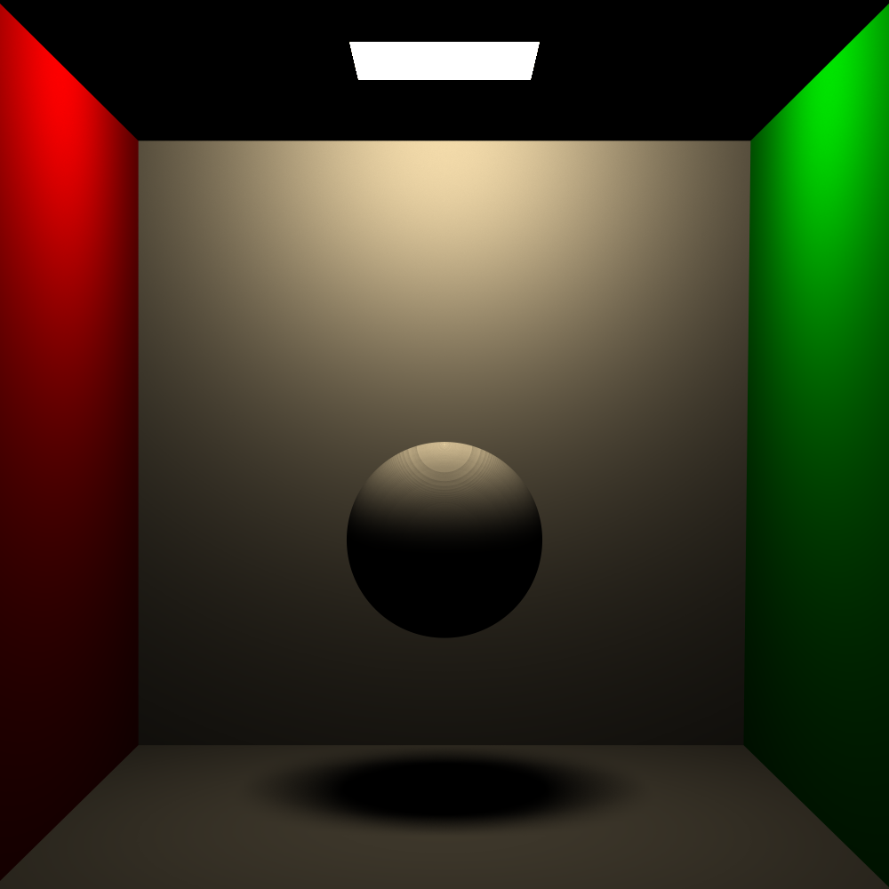

# Renders and performance

### Multiple material types:

8K image rendered with 256 samples per pixel, in 136 minutes on an i7-4790K(4.6GHz all cores).

### Triangle meshes:

Blender's Suzanne, rendered in 4K with 8 samples per pixel, in 16 minutes on the same hardware as above.

### Soft shadows:

Cornell Box at a resolution of 1000x1000. Rendered in 2 min, 45 sec on the same hardware.
