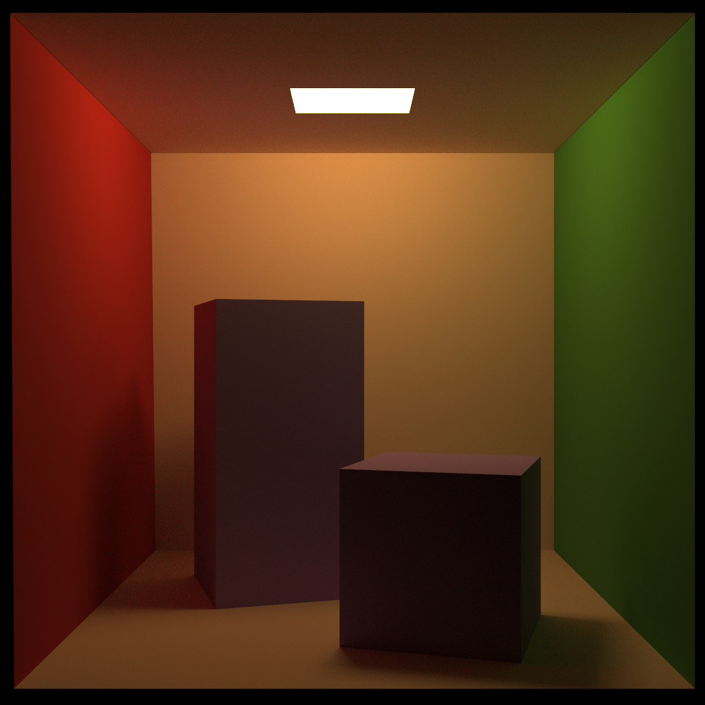
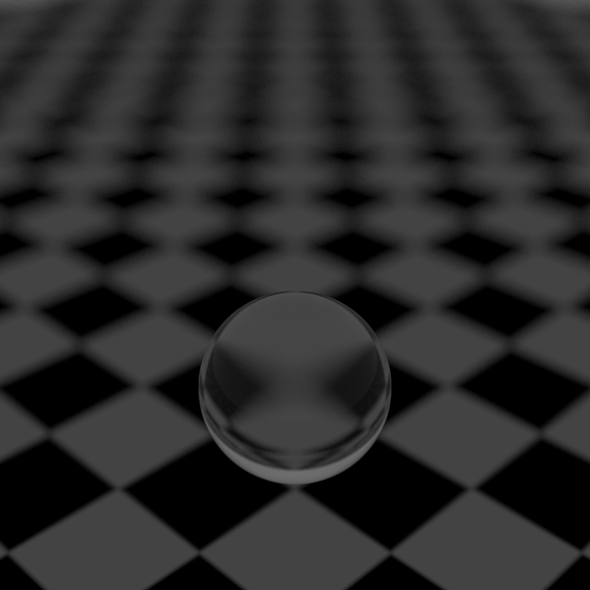

******
Cinder
******

Cinder is a modular raytracer that aims to provide true-to-life, physically based rendering. 
This documentation is a guide for using Cinder to render images, and is also a guide on how to extend
the raytracer to add your own features.

   Cornell Box rendered with path tracer, at a resolution of 1200x1200, with 128 samples per pixel.

   Depth of field rendered with Whitted tracer, at a resolution of 1200x1200, with 128 samples per pixel.

.. toctree::
   :caption: Getting Started
   :maxdepth: 5

   GettingStarted/SettingUp
   GettingStarted/YourFirstRender
